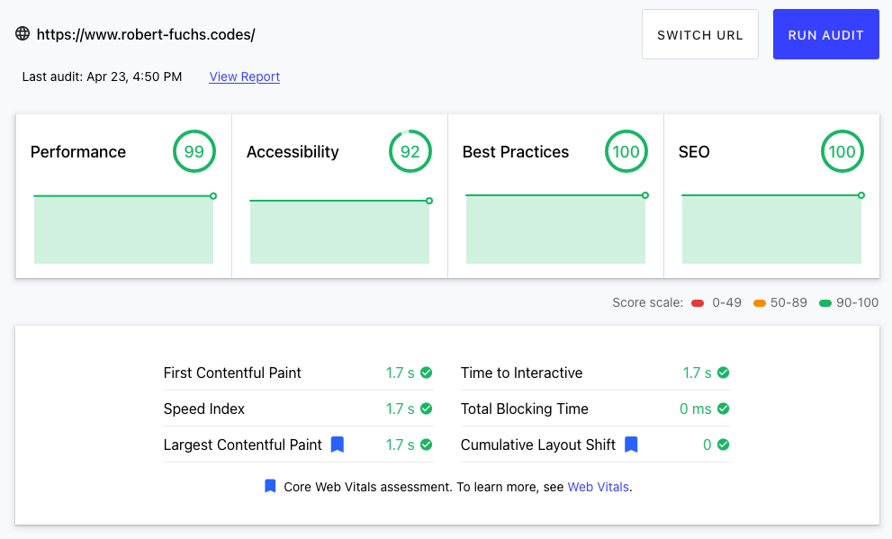

# robert-fuchs.codes - My Personal Website

<https://www.robert-fuchs.codes> is written in TypeScript and build with React.
It utilizes [next.js](https://nextjs.org/) for server-side rendering and [Vercel](https://vercel.com/) as the CDN.

## Technologies Used

- [TypeScript](https://www.typescriptlang.org/)
- [React](https://reactjs.org/)
- [Next.js](https://nextjs.org/)
- [Vercel](https://vercel.com/)

## Performance Score

[Performance score](https://lighthouse-dot-webdotdevsite.appspot.com//lh/html?url=https%3A%2F%2Fwww.robert-fuchs.codes%2F) of <https://www.robert-fuchs.codes> calculated by <https://web.dev/>.



- [x] [Reduce JavaScript payloads with code splitting](https://web.dev/reduce-javascript-payloads-with-code-splitting/)

## Development

- Starting the local development server:

  ```bash
  yarn dev
  ```

- Executing unit tests:

  ```bash
  yarn test
  ```

## Planned Features

- [ ] Make background of tab icon transparent
- [ ] Change app icon for when saving page on mobile
